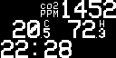

# co2-station
A rudimentary air quality station based on:
* Raspberry Pi Zero W: _single-board computer_
* mh-z19b: _CO2 sensor_
* dht22: _temperature and humidity sensor_
* ssd1306: _OLED Display_

###### Display output example:

